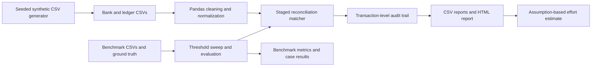

# Automated Bank-to-Ledger Reconciliation System

A portfolio project that uses Python, Pandas, NumPy, and RapidFuzz to reconcile bank-statement records against internal-ledger records, identify exceptions, and produce audit-ready reports. It includes a reproducible synthetic-data generator, a ground-truth benchmark, and a configurable manual-effort estimate.

> **Synthetic data only:** Every financial-looking record included with this project is locally generated synthetic/demo data. No real banking, customer, account, or payment information is used.

## Business problem

Organizations compare bank activity with accounting-ledger entries to confirm that cash movements are recorded correctly. Manual line-by-line tick-off becomes slow and difficult to review as transaction volume grows. Unmatched transactions, amount differences, duplicate entries, and uncertain pairings can be missed or explained inconsistently.

## Why reconciliation is difficult

The two sides often describe the same event differently. References may be absent or reformatted, descriptions can contain spelling and punctuation changes, and posting dates can differ by a few days. Amount differences may signal a real discrepancy, while repeated amounts or references can create multiple plausible candidates. A useful system must find strong matches, leave uncertain cases for review, and explain each decision.

## Project objective

This project standardizes both input files, applies staged matching rules, classifies every source record, and writes a transaction-level audit trail with readable exception reasons. A controlled benchmark measures matching behavior against known outcomes and tunes the fuzzy threshold. A separate effort comparison applies explicitly configured time assumptions to observed row and exception counts; it is an estimate, not a measured business saving.

## Architecture



`run_pipeline.py` orchestrates the complete workflow. The benchmark selects a fuzzy threshold first, and that threshold is used for the generated source-data reconciliation during the same run.

## Input data

The pipeline uses CSV files and Pandas; it does not use a database. The generated bank file contains fields such as `bank_transaction_id`, `transaction_date`, `amount`, `description`, `reference`, and `transaction_type`. The ledger file contains `ledger_transaction_id`, `ledger_date`, `amount`, `narration`, `reference`, and `account_category`.

The reproducible generator writes source data under `data/generated/`. A small, readable sample and controlled benchmark inputs with expected outcomes are under `data/test/`. The benchmark ground-truth file covers each bank and ledger source row and records its expected status and counterpart where applicable.

## Synthetic-data approach

Data is generated locally with a deterministic seed (the default seed is defined in `src/data_generator.py`). The production-style generated set contains at least 300 records on each side. The benchmark contains 300 controlled cases, with 25 cases in each of 12 scenarios. Scenarios include exact and formatting-variant matches, spelling variations, date offsets, amount mismatches, one-sided records, duplicates, and ambiguous candidates.

Regenerate the datasets as part of the full workflow with `python run_pipeline.py`. Use `python run_pipeline.py --seed 12345` to create a different but repeatable dataset. Synthetic scenarios are designed to exercise rules; they are not a statistical representation of any real bank or business.

## Cleaning process

`src/cleaning.py` loads the CSVs with Pandas, validates required columns, parses dates consistently, converts amounts to numeric values and rounds them to two decimal places. It trims whitespace, normalizes case and references, and removes irrelevant punctuation from matching text. The cleaned frames keep original source values alongside standardized fields so report readers can inspect both what arrived and what the matcher used.

Invalid or incomplete required data raises a clear validation error rather than being silently dropped.

## Matching strategy

`src/matching.py` generates plausible candidates using reference, amount, and date evidence, avoiding an indiscriminate comparison of every bank row with every ledger row. The amount and date tolerances, fuzzy threshold, combined-score settings, and related rules are centralized in `src/config.py`.

1. **Exact evidence:** matching normalized reference and amount within configured tolerance, with an acceptable date difference.
2. **Fuzzy description evidence:** amount and date are within tolerance, and RapidFuzz similarity between normalized bank description and ledger narration meets the configured threshold.
3. **Combined evidence:** where configured, text, reference, amount, and date evidence contribute to a candidate score and confidence.

The matcher records the rule (`match_method`) that produced a result along with its score, confidence, amount difference, date difference, and exception reason. A likely textual counterpart with an amount outside tolerance can be classified as a mismatch instead of being silently treated as missing.

### Exact matching

The exact stage prioritizes reference and amount agreement, subject to the configured date window. Description text does not need to be identical when stronger reference and financial evidence agree.

### Fuzzy matching with RapidFuzz

RapidFuzz compares normalized descriptions and narrations to tolerate harmless wording, spacing, capitalization, punctuation, and minor spelling differences. The score and matching stage are retained in the audit output. The threshold is swept against benchmark ground truth, subject to a configured minimum precision; it is not presented as a universal industry threshold.

### Duplicate detection and ambiguity

If multiple records create duplicate or ambiguous evidence, the engine retains the candidates and classifies them for review. It does not quietly choose one candidate and discard the others. Duplicate and ambiguous outcomes are distinguished in reconciliation outputs and human-readable reasons.

### Exception classification

Each source record is represented in the reconciliation output and classified as `MATCHED`, `MISMATCHED`, `MISSING`, or `DUPLICATE`. The report further describes exact/fuzzy matches, missing-bank or missing-ledger records, duplicate cases, and ambiguous candidates. Reasons state which evidence was found or why review is needed.

### Audit trail

The transaction-level audit report retains source IDs, original descriptions/narrations, normalized matching values, outcome, method/rule, fuzzy score, confidence, date and amount differences, and exception reason. This lets a reviewer see which records were considered, why a pairing was made, and which evidence caused an exception.

## Benchmark methodology and performance

The benchmark has **300 controlled cases** and ground truth for every source row. It evaluates integer fuzzy thresholds from the configured minimum through maximum. The selected threshold maximizes automatic match rate among thresholds meeting the configured precision floor (98% by default); ties favor recall, then precision, then the stricter threshold. If no threshold reaches the floor, the benchmark reports the best observed result rather than hiding it. Misclassifications and expected non-automatic cases are written to separate CSV files.

For the current deterministic included benchmark run, the threshold sweep selected **77**. The measured results are:

| Metric | Result |
| --- | ---: |
| Automatic match rate | 58.33% (175 / 300 bank rows) |
| Precision | 100.00% |
| Recall | 100.00% |
| Exact-match rate | 16.67% (50 / 300 bank rows) |
| Fuzzy-match rate | 41.67% (125 / 300 bank rows) |
| False-positive rate | 0.00% |
| False-negative rate | 0.00% |
| Ambiguous-match rate | 100.00% (25 / 25 expected ambiguous bank rows identified) |
| Exception rate | 41.67% (250 / 600 source rows) |

These are results on the included synthetic benchmark, not on real financial data or an independent production sample. The automatic match denominator is all benchmark bank rows; exact and fuzzy rates use the same denominator. Precision is correct predicted bank-ledger pairs divided by predicted matched bank rows. Recall is correctly paired expected matches divided by expected matched bank rows. Exception rate counts unique bank and ledger source rows classified as non-matched.

The automatic match rate is below 90% because this balanced benchmark intentionally includes 125 bank rows expected to require exception handling: 25 amount mismatches, 25 bank-only records, 50 duplicate bank rows, and 25 ambiguous records. Those are not valid automatic matches. All expected cases were classified correctly in the current run; `benchmark_failures.csv` is empty. This case mix makes the overall rate a measure of coverage across both matchable and deliberately unmatchable cases, rather than a claim that every record should be auto-paired.

Run the benchmark alone with `python -m src.benchmark`. The measured threshold, denominators, threshold sweep, per-record outcomes, failures, and expected exception breakdown are saved under `reports/`.

## Manual-effort estimation methodology

Three editable illustrative inputs live in `src/config.py`:

- `MANUAL_REVIEW_MINUTES_PER_TRANSACTION` (default 2.0)
- `MANUAL_REVIEW_MINUTES_PER_EXCEPTION` (default 5.0)
- `AUTOMATED_PROCESSING_OVERHEAD_MINUTES` (default 10.0 per run)

The pipeline uses observed source and exception counts with these assumptions:

```text
N = bank transaction rows + ledger transaction rows
E = distinct source transaction rows classified as exceptions

Baseline manual effort (minutes) = N * assumed manual minutes per transaction
Automated workflow effort (minutes) = processing overhead
                                      + E * assumed review minutes per exception
Estimated effort reduction (minutes) = baseline - automated workflow effort
Estimated effort reduction (%) = (estimated effort reduction / baseline) * 100
```

The current generated run has 720 source rows and 302 exception review units. Under the illustrative defaults above, baseline effort is 1,440 minutes and automated workflow effort is 1,520 minutes, producing an estimated **80-minute increase (-5.56% reduction)**. This is a calculation from stated assumptions and generated counts, not measured time or a business-savings claim. The estimate can be negative and changes with the assumptions and data. Inputs, counts, formulas, and result are written to `reports/manual_effort_comparison.csv` and included in the summary/HTML report.

## Project structure

```text
bank-ledger-reconciliation/
├── data/
│   ├── raw/                 # Reserved for user-provided input CSVs
│   ├── generated/           # Seeded synthetic bank and ledger data
│   └── test/                # Samples, benchmark data, and ground truth
├── reports/                 # Generated reconciliation and benchmark reports
├── src/
│   ├── config.py            # Paths, thresholds, sizes, effort assumptions
│   ├── data_generator.py    # Synthetic data and benchmark ground truth
│   ├── cleaning.py          # Validation and standardization
│   ├── matching.py          # Candidate scoring and staged matching
│   ├── reconciliation.py   # Unified transaction-level audit output
│   ├── reporting.py         # CSV and HTML reports, summary, effort estimate
│   ├── benchmark.py         # Threshold sweep and benchmark metrics
│   └── pipeline.py          # End-to-end orchestration
├── tests/                   # Cleaning, matching, reporting, benchmark, pipeline tests
├── run_pipeline.py          # One-command workflow entry point
├── requirements.txt
└── pytest.ini
```

## Install

Use Python 3.10 or newer, then install the small dependency set:

```shell
python -m pip install -r requirements.txt
```

The runtime dependencies are Pandas, NumPy, and RapidFuzz. Pytest is included for development and verification.

## Run the complete workflow

From the project root:

```shell
python run_pipeline.py
```

This generates synthetic inputs and benchmark files, cleans both sources, tunes the fuzzy threshold, reconciles the source data, computes benchmark and effort metrics, and writes the reports. Add `--seed 12345` to select a reproducible alternate seed. Add `--reports-dir path/to/reports` to choose a report output directory.

## Run tests

```shell
python -m pytest
```

The tests cover cleaning and amount/date handling, exact and fuzzy matching, mismatches, missing records, duplicate and ambiguous candidates, reporting, benchmark calculations, and the end-to-end pipeline.

## Example report outputs

The full run creates these files under `reports/`:

- `reconciliation_report.csv` — transaction-level decisions and audit evidence.
- `discrepancy_report.csv` — exceptions with human-readable reasons.
- `reconciliation_summary.csv` — source counts, status counts, match/exception rates, and aggregate amounts.
- `manual_effort_comparison.csv` — assumptions, formulas, observed counts, and calculated effort estimate.
- `reconciliation_report.html` — a readable HTML version of the generated report.
- `benchmark_metrics.csv` — measured threshold and aggregate benchmark metrics.
- `benchmark_case_results.csv`, `benchmark_failures.csv` — ground-truth comparison by source row and any incorrect outcomes.
- `benchmark_non_automatic_cases.csv`, `benchmark_non_automatic_breakdown.csv` — expected cases requiring review.
- `benchmark_threshold_sweep.csv` — results for every evaluated fuzzy threshold.

## Limitations

- Synthetic examples exercise known scenarios and do not establish real-world coverage or business impact.
- The benchmark is controlled, balanced, and generated by this project; it is not an independent holdout set.
- Rules use configurable tolerances and text similarity. Real payment systems may need institution-specific references, currencies, posting conventions, and reversal handling.
- Ambiguous or duplicate cases are surfaced for human review; the project does not provide a review UI or approval workflow.
- Effort inputs are assumptions rather than stopwatch measurements, and generated exception counts may make the illustrative estimate negative.

## Future improvements

- Add independently authored or consented, safely anonymized evaluation data and a holdout benchmark.
- Report performance by scenario and by transaction attributes, and test threshold stability across seeds.
- Expand matching rules for reversals, split/combined settlements, currency conversion, and institution-specific references.
- Add reviewer feedback capture and evaluate whether decisions improve over time.
- Add configurable CSV schema mapping and validation summaries for different export formats.
- Measure review times in a pilot before making any operational effort or savings claims.

